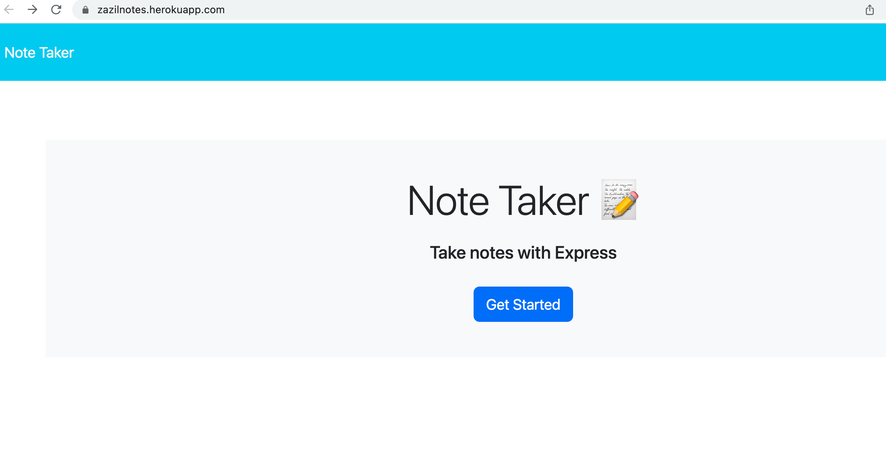
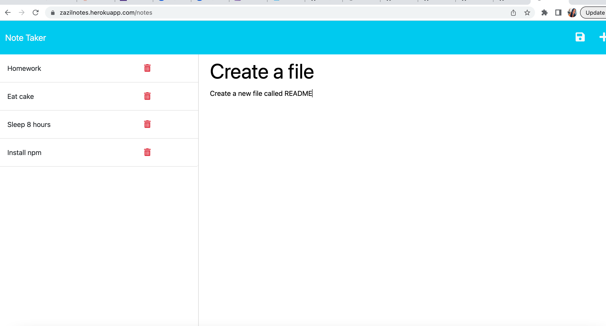

# 11-Note-Taker 📝 
---
## Description
An application Note Taker is going to be used by the user to write and save notes.
Application use express.js back end, saving and retrieving data from a JSON file.

---
## User Story 👇

```
AS A small business owner
I WANT to be able to write and save notes
SO THAT I can organize my thoughts and keep track of tasks I need to complete
```
---
##  📖 Acceptance Criteria 

```
GIVEN a note-taking application
WHEN I open the Note Taker
THEN I am presented with a landing page with a link to a notes page
WHEN I click on the link to the notes page
THEN I am presented with a page with existing notes listed in the left-hand column, plus empty fields to enter a new note title and the note’s text in the right-hand column
WHEN I enter a new note title and the note’s text
THEN a Save icon appears in the navigation at the top of the page
WHEN I click on the Save icon
THEN the new note I have entered is saved and appears in the left-hand column with the other existing notes
WHEN I click on an existing note in the list in the left-hand column
THEN that note appears in the right-hand column
WHEN I click on the Write icon in the navigation at the top of the page
THEN I am presented with empty fields to enter a new note title and the note’s text in the right-hand column
```

---
## 💻  Usage 

To be able to run this application:
Node.js must be installed.
Npm packages, node modules, package.json must be installed, together with other dependencies.
Npm install command must be run in the terminal.
Run node server.js to start the server.

---
##  🔔 URL of the functional deployed application


[Note Taker application link](https://zazilnotes.herokuapp.com/)


---
## Mock-Up 📷








---
© 2023 zazilnotes.herokuapp.com